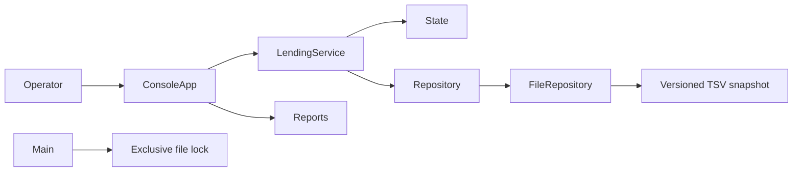
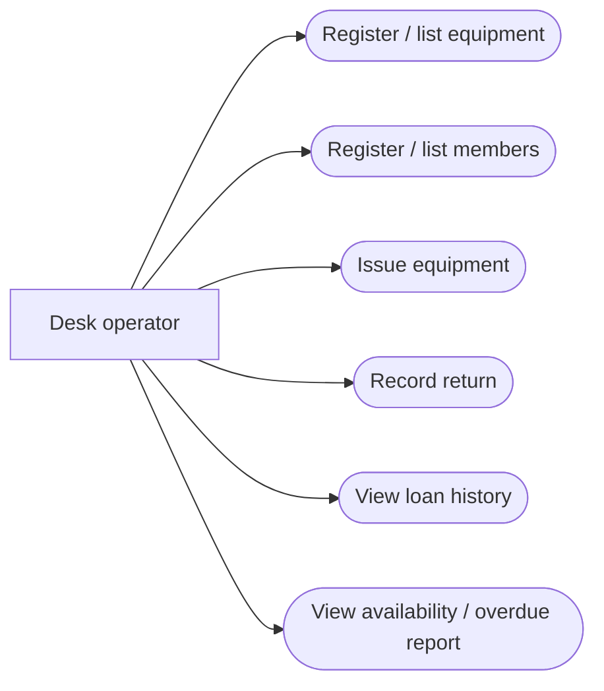
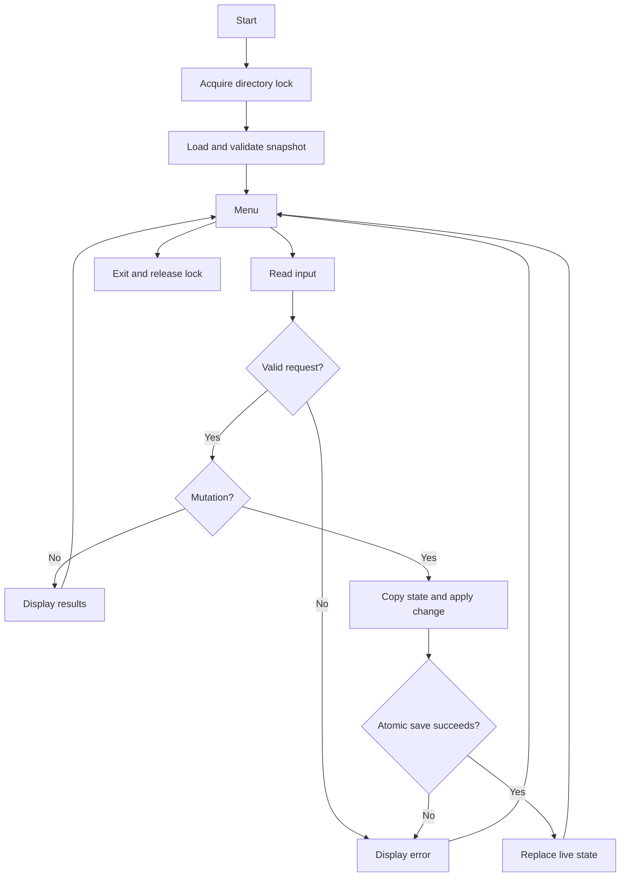
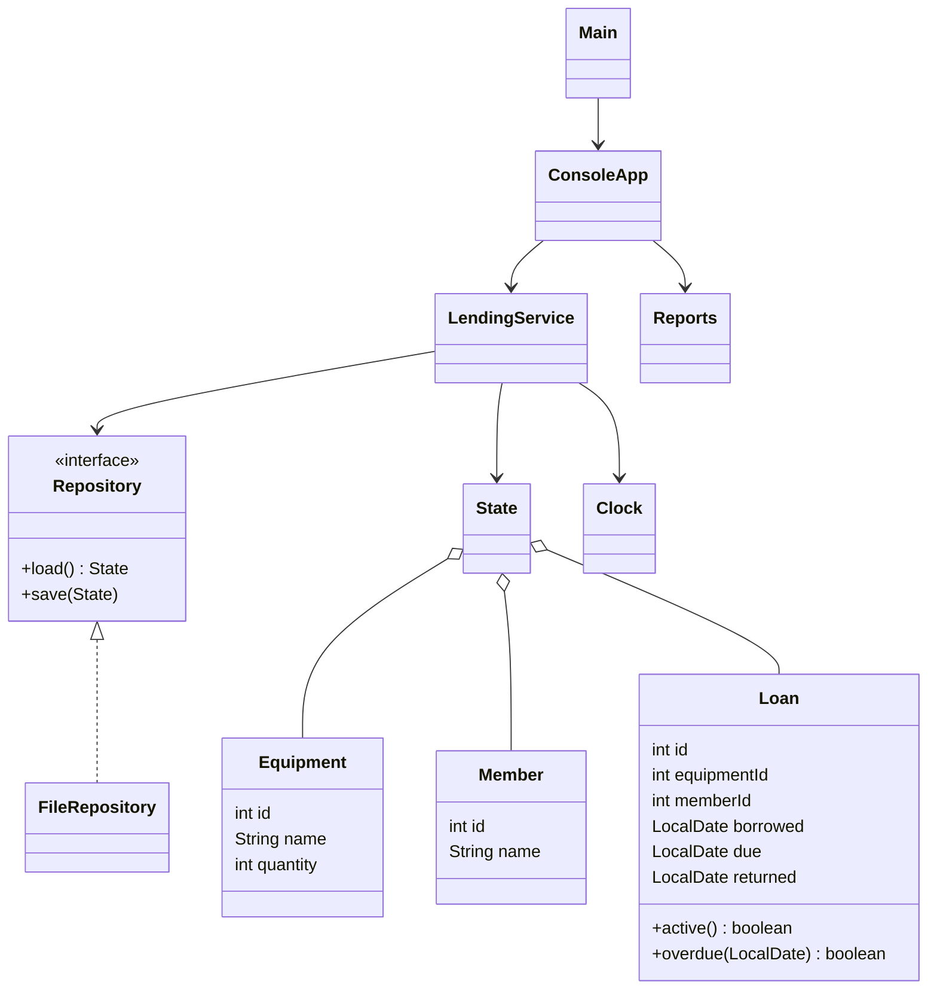
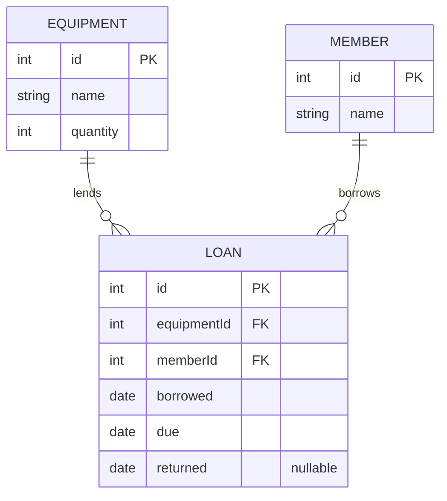

# CampusKit design

## Architecture


## Use cases
The lending-desk operator is the system actor. Members are recorded borrowers, not authenticated application users.


## Workflow


## Borrow sequence
```mermaid
sequenceDiagram
  actor Operator
  participant ConsoleApp
  participant LendingService
  participant FileRepository
  Operator->>ConsoleApp: equipment ID, member ID, days
  ConsoleApp->>LendingService: borrow(equipmentId, memberId, days)
  LendingService->>LendingService: validate stock, dates and borrower eligibility
  LendingService->>LendingService: copy state; create Loan
  LendingService->>FileRepository: save(nextState)
  FileRepository->>FileRepository: write temporary snapshot; atomic move
  FileRepository-->>LendingService: success
  LendingService->>LendingService: publish nextState
  LendingService-->>ConsoleApp: loan ID
  ConsoleApp-->>Operator: confirmation
```
If validation or saving fails, no live-state update occurs and the console displays the error.

## Class relationships


## ER diagram and storage schema


The ER diagram describes logical relationships; there is no SQL database. One UTF-8 TSV file begins with `CAMPUSKIT\t1`. Equipment rows have `E, id, base64(name), quantity`; member rows have `M, id, base64(name)`; loan rows have `L, id, equipmentId, memberId, borrowed, due, returned`. Commas here separate field names; actual separators are tabs. Dates are ISO `YYYY-MM-DD`. Empty returned date means active. IDs are unique positive integers within each entity and are generated as current maximum plus one. Equipment and members are retained, so historic references remain valid.

Availability is derived from quantity minus active loan count, preventing a second stored stock counter from drifting. A member can hold up to three active loans; overdue means `due < today`. A returned loan remains part of history. State copies share immutable records and copy their maps.

## Design rationale and complexity
The Repository interface lets tests inject a failing disk implementation. Clock injection makes deadline tests deterministic. Atomic replacement avoids publishing half-written snapshots; filesystems without atomic-move support reject writes. A file lock protects the CLI lifecycle from concurrent writers. The service alone is not a concurrent server API. Base64 protects delimiters, not confidentiality.

For E equipment types, M members and L loans, storage and memory are O(E+M+L). Saves and state copies are linear. Borrow checks are O(L); displaying all inventory is O(E*L) because availability is calculated per type. This favors simplicity for small club registers, not large-scale throughput. A future indexed database could improve this.
